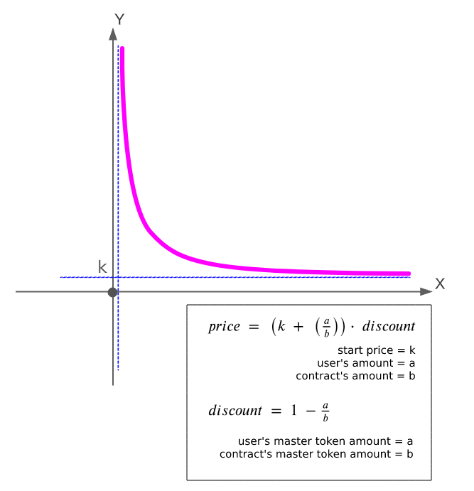

# Sales contract

| Command  | Description |
| ------------- | ------------- |
| `npm install`  | Installs all needed dependencies  |
| `yarn install`  | Installs all needed dependencies  |
| `npm run test-headless`  | Run both `ganache-cli` and `truffle test`  |
| `yarn run test-headless`  | Run both `ganache-cli` and `truffle test`  |
| `npm run test-win`  | Run both `ganache-cli` and `truffle test` on windows OS  |
| `yarn run test-win`  | Run both `ganache-cli` and `truffle test` on windows OS |

:warning: You already have to be installed `ganache` or `ganache-cli`

My formula research link [here](https://docs.google.com/document/d/1-StbrViSvLMT71wDclO3THqKUlCk68AErMXJA3SZDcY/edit?usp=sharing)

# Formulas

